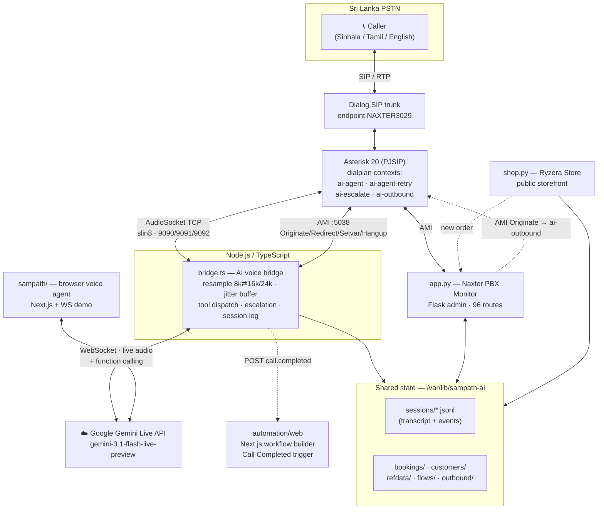
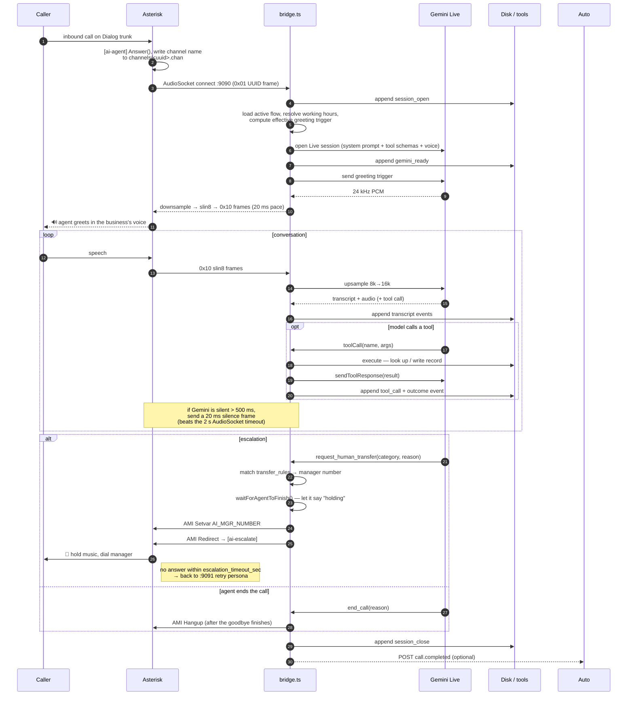

# Ryzera — AI Voice Agents for Sri Lankan Businesses

> A production telephony platform where an AI agent **answers and makes real phone
> calls** in Sinhala, Tamil and English — books appointments, takes orders, looks up
> live data, escalates to a human when it should — plus a visual **automation
> builder** that turns every completed call into a workflow.

Ryzera is not a chatbot with a "call us" button. It is a full PBX stack: a real SIP
trunk from a Sri Lankan carrier, Asterisk, and a low-latency audio bridge that streams
8 kHz telephone audio into **Google Gemini Live** and back, with function calling
wired into real business data.

---

## Table of contents

1. [Purpose & problem](#1-purpose--problem)
2. [System architecture](#2-system-architecture)
3. [Tech stack](#3-tech-stack)
4. [Repository structure](#4-repository-structure)
5. [Setup instructions](#5-setup-instructions)
6. [Core features](#6-core-features)
7. [**AI agent workflow (Open Category)**](#7-ai-agent-workflow-open-category)
8. [Testing](#8-testing)
9. [Deployment](#9-deployment)
10. [Security notes](#10-security-notes)
11. [Project status & roadmap](#11-project-status--roadmap)

---

## 1. Purpose & problem

Small and mid-size Sri Lankan businesses — clinics, restaurants, retailers, real-estate
agents — lose revenue on the phone, not on the web:

| Problem | What it costs |
|---|---|
| Calls ring out after hours and on holidays | Booking goes to the competitor who picked up |
| One receptionist, many simultaneous callers | Queues, hang-ups, no record of who called |
| Callers switch between **Sinhala, Tamil and English** mid-sentence | Scripted IVR menus fail completely |
| Order/appointment confirmations are done by hand | Staff time spent dialling, no-shows unmeasured |
| Nothing is logged | No transcript, no outcome data, no follow-up |

Existing "AI receptionist" products are built for US/EU numbers, English-only, and price
per minute in USD. **Ryzera targets the Sri Lankan market directly:** a local Dialog SIP
trunk, LKR pricing in the demo storefront, and an agent that detects and speaks the
caller's language on its own.

**What Ryzera does**

- **Answers inbound calls** as a business-specific persona (hospital, restaurant, bank,
  retail, real-estate, helpdesk) — 24/7, with no menu tree.
- **Places outbound calls** to confirm orders, remind patients of appointments, and
  deliver lab results.
- **Acts, not just talks** — the agent calls real tools that write real records:
  bookings, orders, reservations, lab requests, captured customer details.
- **Knows when to stop** — it escalates to a human manager over a live warm transfer, and
  falls back to a retry persona if the manager doesn't pick up.
- **Records everything** — every call is an append-only event log with a full transcript,
  every tool call, and the outcome, surfaced in an admin dashboard.
- **Automates the aftermath** — an n8n-style visual builder fires a workflow when a call
  ends (notify, log to a sheet, call an API, ask an LLM to summarise).

---

## 2. System architecture



**The three runtime paths**

1. **Inbound call** — PSTN → Asterisk → AudioSocket → `bridge.ts` → Gemini Live → tools →
   disk → dashboard.
2. **Outbound call** — dashboard button (or shop order) → AMI `Originate` into the
   `[ai-outbound]` context → AudioSocket :9092 → a purpose-built outbound persona.
3. **Post-call automation** — `call.completed` webhook → automation engine → HTTP / IF /
   Set / Wait / LLM nodes.

---

## 3. Tech stack

### Telephony & voice

| Layer | Technology |
|---|---|
| PBX | **Asterisk 20**, PJSIP channel driver |
| Carrier | **Dialog** SIP trunk (Sri Lanka), endpoint `NAXTER3029` |
| Audio transport | Asterisk **`app_audiosocket`** — raw TCP frame protocol (`0x00` hangup, `0x01` UUID, `0x10` audio, `0xFF` error) |
| Codec / sample rate | `slin` 8 kHz signed-linear on the wire; upsampled to **16 kHz** for Gemini input, downsampled from **24 kHz** for Gemini output |
| Call control | **Asterisk Manager Interface (AMI)** on :5038 — `Originate`, `Redirect`, `Setvar`, `Hangup` |
| WebRTC softphone | Asterisk `chan_pjsip` over `ws`/`wss` (`:8088/ws`), browser dialer in the admin UI |

### AI

| Layer | Technology |
|---|---|
| Model | **Google Gemini Live API** — `gemini-3.1-flash-live-preview` |
| SDK | `@google/genai` (browser agent) + a hand-rolled WebSocket client in `src/lib/gemini-live.ts` (bridge) |
| Modality | Native speech-to-speech (`responseModalities: ["AUDIO"]`) — **no separate STT/TTS hop** |
| Voices | 14 selectable Gemini voices — `Aoede` (default), `Zephyr`, `Kore`, `Leda`, `Callirrhoe`, `Autonoe`, `Despina`, `Erinome`, `Laomedeia`, `Achernar`, `Gacrux`, `Pulcherrima`, `Vindemiatrix`, `Sulafat` |
| Agent capability | **Function calling** — 13 server-side tools (see §7) |
| Languages | Sinhala / Tamil / English, auto-detected per utterance by the model |
| Optional | OpenAI-compatible LLM node inside the automation engine (for call summarisation) |

### Backend

| Layer | Technology |
|---|---|
| Voice bridge | **Node.js + TypeScript**, run via `tsx`; `net`, `fs`, `perf_hooks` (event-loop watchdog) |
| Admin panel | **Python 3 + Flask** (`app.py`, 96 routes), Werkzeug password hashing, session auth + per-permission decorators |
| Storefront | **Python 3 + Flask** (`shop.py`) — public, unauthenticated, server-side revalidated |
| Automation engine | **TypeScript** (pure, framework-free) + **Next.js Route Handlers**; original **Python/stdlib** engine kept as the reference implementation |
| Persistence | **Flat JSON / JSONL on disk** under `/var/lib/sampath-ai` — atomic writes, no SQL server |
| Cloud extras | `boto3` (optional AWS Polly TTS previews) |

### Frontend

| Layer | Technology |
|---|---|
| Automation builder | **Next.js 16** (App Router, Turbopack) · **React 19** · **TypeScript** |
| UI kit | **ShadCN** (Base UI) · **Tailwind CSS v4** · `lucide-react` · `sonner` · `next-themes` · `cmdk` |
| Workflow canvas | **React Flow** (`@xyflow/react` v12) |
| Admin panel UI | Jinja2 templates + vanilla JS + Tailwind (CDN), React Flow for the call-flow editor |
| Browser voice demo | Next.js 16 + React 19, Web Audio API, Cloudflare Turnstile gate |

### Infrastructure

| Layer | Technology |
|---|---|
| Process management | **systemd** — `sampath-ai`, `pbx-monitor`, `pbx-monitor-ryzera`, `naxter-shop`, `naxter-automations`, `voip-probe.timer` |
| Networking | **Cloudflare Tunnel** for public hostnames · **Tailscale** for private service binding |
| Deployment | Idempotent bash installers (`install-*.sh`) that back up before overwriting |
| Observability | `journalctl`, SIP `tcpdump` rolling capture, 10-second trunk probe timer, JSONL session logs, SSE live streams |

### Testing

| Layer | Technology |
|---|---|
| Automation engine (TS) | **Vitest** — engine parity suite |
| Automation engine (Py) | **`unittest`** — 28 unit + API tests |
| Linting | ESLint 9 + `eslint-config-next` |

---

## 4. Repository structure

Each top-level folder is an **independently runnable project**. They share data
through the filesystem, not through imports — so any one of them can be started,
tested and demoed on its own.

```
ryzera/
├── voip-recovery-staging/          ── the telephony + AI call platform
│   ├── bridge.ts                   AudioSocket ⇄ Gemini Live bridge (Node/TS)
│   ├── src/lib/                    bridge internals
│   │   ├── gemini-live.ts          Gemini Live WebSocket client (audio + tool calls)
│   │   ├── agent-config.ts         flow/persona loader, working-hours model
│   │   ├── sampath-data.ts         live branch + forex lookup with background refresh
│   │   └── memory.ts               per-caller memory store
│   ├── package.json · tsconfig.json   bridge dependencies
│   ├── agent-config.example.json   example persona config (copy & edit)
│   ├── app.py                      Naxter PBX Monitor — Flask admin, 96 routes
│   ├── templates/ · static/        the admin UI (26 pages + assets)
│   ├── seeds/                      starter flow personas
│   ├── asterisk/ai-outbound.conf   dialplan context for outbound AI calls
│   ├── flows/                      call-flow / persona editor (v1 + v2)
│   │   ├── patches/                agent-config, gemini-live, extensions.conf patch
│   │   ├── prompts/                hospital appointment system + instruction prompts
│   │   └── seeds/                  ready-made personas (real-estate, software-company)
│   ├── dashboards/                 per-industry dashboards
│   │   ├── refdata/                catalogs: hospital, reservations, sales
│   │   └── templates/              industry.html, agent_mode.html, users.html, base.html
│   ├── shop/shop.py                Ryzera Store — public storefront feeding the call queue
│   ├── install-*.sh                idempotent installers (agents, flows, dashboards, shop…)
│   ├── voip-probe.*                 10s SIP trunk health probe (systemd timer)
│   └── snapshot.sh                 diagnostic snapshot capture
│
├── automation/                     ── n8n-style visual workflow builder
│   ├── automations.py              Python/stdlib engine + Flask API (reference impl)
│   ├── run.py                      standalone dev server (:5099)
│   ├── test_automations.py         28 unit + API tests
│   ├── templates/ · static/        Flask prototype canvas
│   └── web/                        **the current app** — Next.js 16 + TS
│       ├── src/lib/engine/         pure-TS engine: catalog, expressions, executors, run
│       ├── src/app/api/automations/  Route Handlers (REST + public webhook)
│       ├── src/components/automations/builder/  React Flow canvas, node picker, panels
│       └── deploy/                 systemd unit + call-webhook integration spec
│
├── sampath/                        ── browser voice agent (Next.js + WebSocket demo)
│   ├── ws-server.ts                WS ⇄ Gemini Live relay (:3002)
│   ├── server.ts                   production entry
│   └── src/                        VoiceAgent, CallStatus, CaptchaGate, audio-utils
│
└── automations-sprint-build-guide.md   full engineering spec for the automation feature
```

---

## 5. Setup instructions

### Prerequisites

| Requirement | Needed for | Notes |
|---|---|---|
| **Node.js 20+** and npm | bridge, automation builder, browser agent | |
| **Python 3.10+** | admin panel, storefront, Python engine | |
| **Google Gemini API key** | every AI path | https://aistudio.google.com/apikey |
| Asterisk 20 with `app_audiosocket` + `chan_pjsip` | live phone calls only | not needed for the two web apps |
| A SIP trunk (e.g. Dialog) | live phone calls only | |
| Linux + systemd | production install | dev works on any OS for the web apps |

> **You do not need a PBX to evaluate this project.** The automation builder and the
> browser voice agent run standalone on a laptop. Only §5.3 requires Asterisk.

---

### 5.1 Automation builder (no telephony required)

```bash
cd automation/web
npm install
npm run dev
```

Open **http://localhost:3000** → redirects to `/automations`.

- `/automations` — dashboard: create, import, run, activate, delete workflows
- `/automations/<id>` — the visual builder (drag, wire, configure, Save / Run)
- `/form/<token>` — public hosted form for `formTrigger` nodes
- `POST /api/automations/hook/<token>` — public webhook trigger

Workflows are stored as JSON under `automation/web/data/` (git-ignored). Override with
`AUTOMATIONS_DATA_DIR`, `AUTOMATIONS_DIR`, `AUTOMATIONS_RUNS_DIR`, `AUTOMATIONS_STATE_DIR`,
`AUTOMATIONS_VERSIONS_DIR`.

The original Python engine still runs standalone if you want to compare implementations:

```bash
cd automation && pip install -r requirements.txt && python run.py   # :5099
```

---

### 5.2 Browser voice agent (no telephony required)

```bash
cd sampath
cp .env.local.example .env.local   # then add your key (see below)
npm install
npm run dev
```

`.env.local`:

```bash
GEMINI_API_KEY=your_key_here
WS_PORT=3002
# optional — enables the bot gate on the demo page
NEXT_PUBLIC_TURNSTILE_SITE_KEY=
TURNSTILE_SECRET_KEY=
```

`npm run dev` starts Next.js on **:3001** and the WebSocket relay on **:3002**
concurrently. Open http://localhost:3001, allow microphone access, and talk to the agent.

---

### 5.3 Full telephony platform

**a. Asterisk** — add the AI contexts to `/etc/asterisk/extensions.conf`:

```bash
sudo cat voip-recovery-staging/asterisk/ai-outbound.conf >> /etc/asterisk/extensions.conf
sudo asterisk -rx "dialplan reload"
```

Your inbound route must hand the call to AudioSocket, e.g.:

```
[ai-agent]
exten => s,1,Answer()
 same => n,Set(__AI_UUID=${UUID})
 same => n,System(mkdir -p /var/lib/sampath-ai/channels && echo '${CHANNEL}' > /var/lib/sampath-ai/channels/${AI_UUID}.chan)
 same => n,AudioSocket(${AI_UUID},127.0.0.1:9090)
 same => n,Hangup()
```

**b. The AI bridge**

```bash
cd voip-recovery-staging
npm install
cp agent-config.example.json /var/lib/sampath-ai/agent-config.json   # then edit it
```

Create `voip-recovery-staging/.env` (or `/opt/sampath-ai/.env` for the systemd install):

```bash
GEMINI_API_KEY=your_key_here
AUDIOSOCKET_HOST=127.0.0.1
AUDIOSOCKET_PORT=9090            # inbound
AUDIOSOCKET_PORT_RETRY=9091      # post-failed-transfer retry persona
AUDIOSOCKET_PORT_OUTBOUND=9092   # outbound campaigns
SAMPATH_SESSIONS_DIR=/var/lib/sampath-ai/sessions
SAMPATH_CUSTOMERS_DIR=/var/lib/sampath-ai/customers
SAMPATH_CHANNEL_DIR=/var/lib/sampath-ai/channels
SAMPATH_REFDATA_DIR=/var/lib/sampath-ai/refdata
SAMPATH_BOOKINGS_DIR=/var/lib/sampath-ai/bookings
SAMPATH_OUTBOUND_DIR=/var/lib/sampath-ai/outbound
# optional — fire the automation engine when a call ends (see §7.7)
CALL_WEBHOOK_URL=
CALL_WEBHOOK_SECRET=
```

Run it straight from the repo: `npx tsx bridge.ts` (or install the `sampath-ai`
systemd unit — §9).
The bridge creates every directory above on boot and logs three listeners:

```
[bridge] primary  AudioSocket on 127.0.0.1:9090
[bridge] retry    AudioSocket on 127.0.0.1:9091
[bridge] outbound AudioSocket on 127.0.0.1:9092
```

**c. Admin panel**

```bash
pip install flask werkzeug boto3
python voip-recovery-staging/app.py                 # dev, port 5051
# or, for the systemd install:
sudo bash voip-recovery-staging/install.sh          # installs to /opt/pbx-monitor
```

The `templates/` and `static/` folders next to `app.py` are the full admin UI (26 pages).

AMI credentials go in `/opt/pbx-monitor/instance/ami.json` (`{"user": "...", "secret": "..."}`) —
**the bridge reads the same file**, so configure it once. Users live in
`instance/auth.json` with Werkzeug password hashes and per-user permissions
(`admin`, `call`, …).

**d. Storefront** (optional demo)

```bash
sudo bash voip-recovery-staging/install-shop.sh     # port 5055
```

---

### 5.4 Port map

| Port | Service |
|---|---|
| 5038 | Asterisk AMI |
| 8088 | Asterisk WebSocket (WebRTC softphone) |
| 9090 / 9091 / 9092 | AudioSocket — inbound / retry / outbound |
| 5051 | Naxter PBX Monitor (admin) |
| 5052 | Ryzera-branded monitor clone |
| 5055 | Ryzera Store (storefront) |
| 5056 | Naxter Automations (production) |
| 5099 | Python automation engine (dev) |
| 3000 | Automation builder (dev) |
| 3001 / 3002 | Browser voice agent — Next.js / WebSocket |

---

## 6. Core features

### 6.1 AI calling

- **Inbound answering** with a per-business persona, no IVR menu tree.
- **Automatic language detection** — Sinhala, Tamil, English, including mid-call switching.
- **Barge-in / interruption** — the caller can talk over the agent; the model handles it natively.
- **Outbound campaigns** — four purpose-built outbound personas: order confirmation,
  appointment confirm/remind, lab-results-ready, and critical-result notification.
- **Warm human transfer** with per-category routing rules and a **retry persona** that
  apologises and re-engages when the manager doesn't answer.
- **Working-hours awareness** — per-day schedule in `Asia/Colombo` with configurable
  out-of-hours behaviour (greet / transfer / hang up with a message).
- **Test mode** — route every escalation to a test number so demos never call a real manager.

### 6.2 Voice engineering

Real telephony is unforgiving, and several bugs here were found and fixed against live calls:

- **Silence keep-alive** — `app_audiosocket` drops the TCP session after 2000 ms with no
  inbound frames. When Gemini is silent (waiting for the caller), the bridge injects a
  20 ms `slin8` silence frame every ~500 ms. *Without this, every call died ~10 s after
  the greeting.*
- **Resampling chain** — 8 kHz → 16 kHz upsample for Gemini input, 24 kHz → 8 kHz
  downsample with a low-pass filter for output.
- **Jitter buffer + pace timer** — audio is primed then released on a 20 ms cadence, so
  network bursts don't become robotic playback.
- **Event-loop watchdog** — `monitorEventLoopDelay` warns when Node stalls > 200 ms p99,
  because a blocked loop is heard as choppy audio.
- **Transfer sequencing** — `waitForAgentToFinish()` blocks the AMI `Redirect` until the
  agent has actually finished saying *"please hold, I'm transferring you"*.

### 6.3 Admin panel (Naxter PBX Monitor — 96 routes)

- Live dashboard: active channels, CDR, call charts, status breakdown.
- **Call-flow / persona editor** — visual editor for each agent: system prompt, voice,
  greeting triggers, enabled tools, transfer rules, working hours, recording toggle.
  Personas ship as seeds (hospital, restaurant, retail, real-estate, software company,
  helpdesk, bank) and one is set as the live `active-flow`.
- **Session viewer** — per-call transcript, tool calls, extracted fields and recording,
  streamed live over **SSE**.
- **Industry dashboards** — hospital (appointments, doctors, lab tests), reservations,
  sales (orders, stock) — each backed by a JSON refdata catalog shared with the agent.
- **One-click outbound** — call a customer about an order, appointment or lab result.
- PJSIP endpoint + trunk health, dialplan and config editors, Asterisk reload/restart.
- Sound management, TTS preview (Gemini voices and optional AWS Polly), voicemail,
  recordings, browser **WebRTC softphone**.
- **Trunk recovery** — a "Recover trunk" button that restarts the route and re-qualifies
  the endpoint in ~15 s instead of rebooting the server, with a diagnostic snapshot
  captured on every attempt.
- User management with hashed passwords and per-permission access control.

### 6.4 Automation builder

- Visual, **n8n-style canvas** (React Flow) — add nodes from a node's `+` handle via a
  searchable picker, double-click to configure, "Tidy" for topological auto-layout.
- **14 node types**: `manualTrigger`, `webhookTrigger`, `formTrigger`, `scheduleTrigger`,
  **`callCompletedTrigger`**, `httpRequest`, `if`, `set`, `wait`, `respondToWebhook`,
  `code`, `googleSheets`, `email`, `openAi`.
- **Safe expressions** — `{{ $json.field.path }}` is resolved by a parser, **never `eval`**.
- Per-node and per-run status, run log with the input/output of every node.
- **Version history + restore**, export/import as JSON, active/inactive toggle.
- Public **webhook** and **hosted form** endpoints, token-gated, with an optional
  `X-Webhook-Secret` shared secret.
- Light/dark theme.

### 6.5 Storefront

A public shop that shares the product catalog with the voice agent, shows **live
availability** (stock minus quantities held by non-cancelled orders), and writes checkout
orders straight into the store the sales dashboard reads — where they enter the **AI
confirmation-call queue**. Prices and totals are recomputed server-side, customer text is
HTML-escaped, quantities clamped, and requests are rate-limited per IP.

---

## 7. AI agent workflow (Open Category)

This section describes how the AI agent is designed, what it can do, and how a call
flows end to end.

### 7.1 Agent design

Ryzera uses a **single speech-to-speech agent with server-side tool execution**, not a
pipeline of STT → LLM → TTS. Audio goes from the phone line into Gemini Live and comes
back as audio, so there is no transcription hop to add latency or lose Sinhala/Tamil
prosody. Everything that must be *correct* — availability, prices, doctor rosters,
booking IDs — is handled by **tools**, not by the model's memory.

The agent's behaviour comes from three composable layers:

| Layer | Source | What it controls |
|---|---|---|
| **Persona** | `system_prompt` + `custom_instructions` in the active flow | who the agent is, tone, rules, what it must never do |
| **Opening move** | `greeting_trigger` / `retry_greeting_trigger` | the instruction that fires the agent's first turn (there is no pre-recorded greeting) |
| **Capability** | `tools_enabled` + `tools_config` | exactly which of the 13 tools this business's agent may call |

All three are edited in the admin UI and stored per business as a flow JSON, so one
deployment serves a hospital and a restaurant with no code change.

### 7.2 Inbound call lifecycle



### 7.3 The tool layer

The agent's 13 tools. Every one runs **server-side in `bridge.ts`** and returns a
structured result the model must speak from — the model never invents a booking ID, a
price or a stock level.

| Tool | Purpose | Side effect |
|---|---|---|
| `save_customer_info` | Store a fact about the caller (name, NIC, email, complaint…) | writes `customers/<caller>.json`, emits an `extracted` event |
| `request_human_transfer` | Escalate, with a category and a reason | matches `transfer_rules` → AMI `Setvar` + `Redirect` to `[ai-escalate]` |
| `end_call` | Hang up gracefully after saying goodbye | AMI `Hangup` once the farewell audio has drained |
| `find_doctor` | Resolve a specialty/name to available doctors, branches and sessions | reads the hospital refdata catalog |
| `book_appointment` | Book a doctor's appointment | writes a booking + assigns a **queue number** for that doctor/branch/date |
| `order_lab_test` | Order a laboratory test | matches the test catalog, upserts the patient, writes the order |
| `book_reservation` | Reserve a table | writes a reservation record |
| `find_product` | Look up a product | reads the sales catalog |
| `place_order` | Place a retail order | writes an order with a reference, respecting **live** stock (stock − reserved) |
| `confirm_order` | *(outbound)* Confirm / cancel / reschedule an order | updates the order record with the outcome |
| `call_outcome` | *(outbound)* Record confirmed / cancelled / reschedule / acknowledged | stamps the outcome + note on the target record |
| `find_sampath_branch` | Look up a bank branch by town/area | live branch database, refreshed in the background |
| `get_exchange_rates` | Fetch live forex rates | returns TTBUY/TTSEL with the effective-from timestamp |

Two details that matter in practice:

- **Tool results carry instructions, not just data.** A lookup that finds nothing returns
  a `note` telling the agent how to recover — *"apologise, ask them to clarify the
  location, or suggest the main hotline."* This keeps failure handling out of the system
  prompt and next to the data.
- **Freshness is asserted.** Live results are labelled as live (*"these are LIVE rates
  effective from …; always mention the effective_from timestamp"*), so the agent doesn't
  present cached data as current.

### 7.4 Escalation to a human

1. The model calls `request_human_transfer(category, reason)`.
2. The bridge resolves the target from the flow's `transfer_rules`: exact category match →
   `default` rule → first rule → the global manager number. **The bridge decides, not the
   dialplan**, so per-business routing applies per call.
3. `waitForAgentToFinish()` holds the redirect until the agent has stopped speaking, so
   the caller is never cut off mid-sentence.
4. `AMI Setvar AI_MGR_NUMBER` pushes the chosen number onto the channel, then
   `AMI Redirect` moves it to `[ai-escalate]`. The dialplan keeps a `jq` fallback so a
   failed `Setvar` can never strand a call.
5. Hold music plays while the manager is dialled.
6. **If no one answers within `escalation_timeout_sec`,** the dialplan sends the caller
   back to the AI — on port **9091**, where the bridge loads the `retry_greeting_trigger`
   persona: *"sorry, the manager isn't available right now — let me help you instead."*

### 7.5 Outbound agents

An outbound call gets a **generated, single-purpose persona**. The dashboard writes the
call's context to `outbound/<uuid>.json`, then AMI-originates into `[ai-outbound]`, which
bridges to port 9092. `buildOutboundConfig()` reads that context and builds the persona:

| Context `kind` | Agent behaviour | Tools |
|---|---|---|
| `order_confirm` | Reads the order back with total and payment method, confirms the delivery address | `confirm_order`, `end_call` |
| `appt_confirm` / `appt_reminder` | Confirms the appointment still suits the patient, offers reschedule | `call_outcome`, `end_call` |
| `lab_ready` | Tells the patient results are ready to collect | `call_outcome`, `end_call` |
| `lab_critical` | Calm, serious; advises prompt follow-up and **asks the patient to read back** what they should do | `call_outcome`, `end_call` |

Each is scoped to exactly one job — *"do not discuss anything unrelated to this order"* —
and each gets only the two tools it needs. That scoping is the guardrail: an outbound
confirm agent structurally cannot book an appointment or transfer a caller.

The clinical one is deliberately conservative: it must **not** give medical advice beyond
"see your doctor promptly", and it requires an explicit acknowledgement before it records
the outcome.

### 7.6 Observability — every call is an event log

The bridge appends one JSON line per event to `sessions/<uuid>.jsonl`:

```
session_open → gemini_ready → caller_id → transcript* → tool_call* → lookup*
→ extracted* → booking_created / order_created / call_outcome
→ escalation_requested → ami_setvar → ami_redirect → session_close
```

This log is the system's source of truth. The admin UI streams it live over SSE, and it is
what makes the agent debuggable: for any call you can see exactly what the caller said,
what the agent said, which tool it called with which arguments, what came back, and why
the call ended.

### 7.7 Closing the loop — call → automation

When a call ends, the bridge can POST a `call.completed` payload to the automation
engine's **Call Completed** trigger node:

```jsonc
{
  "event": "call.completed",
  "call": { "uuid": "…", "direction": "inbound", "caller_num": "…",
            "duration_sec": 92.4, "close_reason": "…", "escalated": false,
            "language": "si" },
  "agent": { "id": "durdans", "name": "…" },
  "transcript": [ { "role": "user", "text": "…" }, … ],
  "transcript_text": "user: …\nmodel: …",
  "tool_calls": [ { "name": "book_appointment", "args": { … } } ],
  "extracted_fields": { "name": "…", "phone": "…" },
  "outcome": { "type": "booking_created", "booking_id": "…" }
}
```

The node filters by agent id and direction, optionally verifies an `X-Webhook-Secret`, and
starts the workflow with the payload as `$json`. From there a non-developer can build,
for example:

> **Call Completed** → **IF** `{{ $json.outcome.type }}` is `booking_created` →
> **Google Sheets** append → **HTTP Request** to the CRM → **OpenAI** summarise the
> transcript → **Email** the summary to the branch manager.

Consecutive same-role transcript fragments are merged into utterances before sending, so
workflow steps get clean turns rather than streaming shards.

### 7.8 Guardrails

| Risk | Mitigation |
|---|---|
| Model invents prices, stock, doctors, booking IDs | All of it comes from tools reading real catalogs; the model is told to read results back verbatim |
| Model oversteps its role on an outbound call | Per-call persona is scoped to one task and given only 2 tools |
| Model gives medical advice | `lab_critical` prompt explicitly forbids advice beyond "follow up promptly" |
| Agent traps a caller who wants a human | `request_human_transfer` is always available on inbound flows; failed transfers fall back to a retry persona instead of dropping |
| Bad phone numbers / names written to records | `validPhone()` / `validName()` validate before persisting |
| Agent answers when the business is closed | Working-hours check with configurable greet / transfer / hang-up behaviour |
| Demo calls reach a real manager | `test_mode` routes every escalation to a test number |
| Untraceable AI decisions | Every tool call, argument and result is logged to the session JSONL |
| Workflow expressions executing arbitrary code | `{{ }}` is a parser, never `eval` |

---

## 8. Testing

```bash
# Automation engine — TypeScript (Vitest)
cd automation/web && npx vitest run

# Automation engine — Python (unittest)
cd automation && python test_automations.py
```

Current results:

| Suite | Tests | Status |
|---|---|---|
| `automation/web` — Vitest engine parity | 7 | ✅ passing |
| `automation` — Python unit + API | 28 | ✅ passing |

The Python suite covers expression resolution, IF routing (string / numeric / regex /
empty), branch pruning, the Wait cap, Set including `keepOnlySet`, HTTP soft-errors,
save/load validation, the full `run_workflow` walk, and the JSON API end to end
(create → save → run → runs → stats).

Telephony paths are verified against live calls — placing a call, letting it sit silent
past the 2 s AudioSocket timeout, triggering a transfer, and confirming the session JSONL
contains the expected event sequence.

---

## 9. Deployment

Every service runs under **systemd**; public hostnames are served through **Cloudflare
Tunnel**, and internal-only services bind a **Tailscale** address instead of `0.0.0.0`.

| Unit | What it runs | Port |
|---|---|---|
| `sampath-ai` | `bridge.ts` (tsx) | 9090–9092 |
| `pbx-monitor` | `app.py` admin | 5051 |
| `pbx-monitor-ryzera` | rebranded admin clone | 5052 |
| `naxter-shop` | `shop.py` storefront | 5055 |
| `naxter-automations` | Next.js production server | 5056 |
| `voip-probe.timer` | 10 s SIP trunk probe | — |

The installers (`install.sh`, `install-shop.sh`, `install-dashboards.sh`,
`install-outbound.sh`, `install-ryzera-monitor.sh`, `automation/web/deploy/`) are
**idempotent** — each backs up the file it replaces as `*.bak-<tag>-<timestamp>` and can
be re-run safely. `uninstall.sh` restores the most recent backups and removes the units.

```bash
cd automation/web && npm ci && npm run build
sudo cp deploy/naxter-automations.service /etc/systemd/system/
sudo systemctl daemon-reload && sudo systemctl enable --now naxter-automations
journalctl -u naxter-automations -f
```

---

## 10. Security notes

- **No secrets are committed.** All keys come from environment files (`.env`,
  `.env.local`) and instance files (`instance/ami.json`, `instance/auth.json`) that are
  git-ignored. Copy the examples in §5 and supply your own.
- **Admin panel** — session auth, Werkzeug password hashes, per-route permission
  decorators (`@login_required`, `@perm_required('admin')`).
- **Storefront** is public by design, so it revalidates everything server-side: prices and
  totals recomputed from the catalog, customer text HTML-escaped, quantities clamped,
  per-IP rate limiting, 64 KB request cap.
- **Automation webhooks/forms** are token-gated with an optional `X-Webhook-Secret`;
  inactive workflows return `403`.
- **The standalone automation server ships with no authentication.** Bind it to a
  Tailscale/loopback address or put it behind Cloudflare Access — never expose it on
  `0.0.0.0`. The engine is auth-agnostic (`init_automations(app, login_required=…,
  perm_required=…)`) precisely so it can inherit the admin panel's auth once mounted.
- **PII** — session logs contain full transcripts and caller numbers. They stay on the
  host; the `call.completed` webhook travels over the private tailnet. If you don't want
  transcripts leaving the box, send `call.uuid` only and have the workflow fetch what it
  needs.

---

## 11. Project status & roadmap

| Component | Status |
|---|---|
| Asterisk ⇄ Gemini Live bridge, inbound + retry | ✅ live, taking real calls |
| Outbound AI calls (order / appointment / lab) | ✅ live |
| 13 agent tools + escalation + working hours | ✅ live |
| PBX Monitor admin, flow editor, industry dashboards | ✅ live |
| Storefront → AI confirmation-call queue | ✅ live |
| Automation engine + visual builder (Next.js) | ✅ built & tested |
| `call.completed` webhook emitter in `bridge.ts` | 📝 specified in `automation/web/deploy/sampath-ai-call-webhook.md`, not yet applied |
| Automation app mounted inside the admin panel's auth | 🔜 next |
| Durable waits, cron scheduling, secrets vault | 🔜 planned |

**Next up:** apply the `call.completed` emitter so every call ends in a workflow run;
mount the automation engine inside the admin app so it inherits authentication; add
durable (cross-restart) waits and scheduled triggers.

---

## Credits

Built for Sri Lankan businesses — trilingual by default, on a local carrier, with LKR
pricing. Branded per client (Naxter · Ryzera · Sampath AI) from a single engine.
